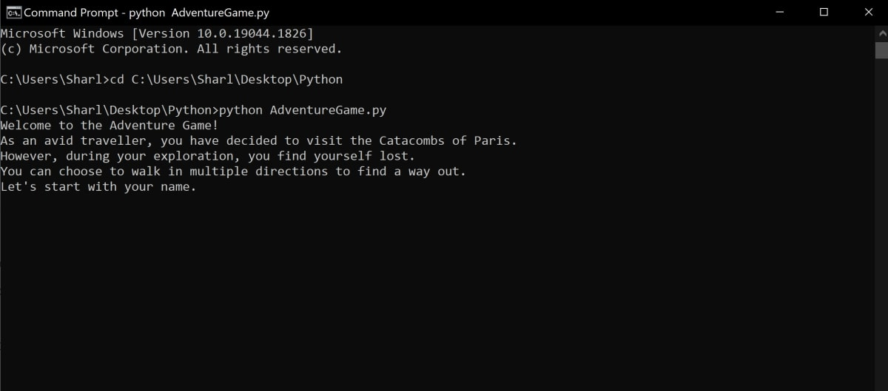

# python-adventure-game
This is a small script featuring an adventure game made in Python.

This tutorial includes basic programming concepts such as separating scenes into functions, and using if-statements to change the scenario based on what the player selects.

## Prerequisites 

* Make sure you have [Python](https://www.python.org/downloads/) on your computer. 

## To Run

* Open the command line or terminal, and navigate to the file where the python script is stored. For example: `cd C:\Users\Sharl\Desktop\python-adventure-game`
* Run the python command: `python AdventureGame.py`
* The text adventure game will start.

## Example

